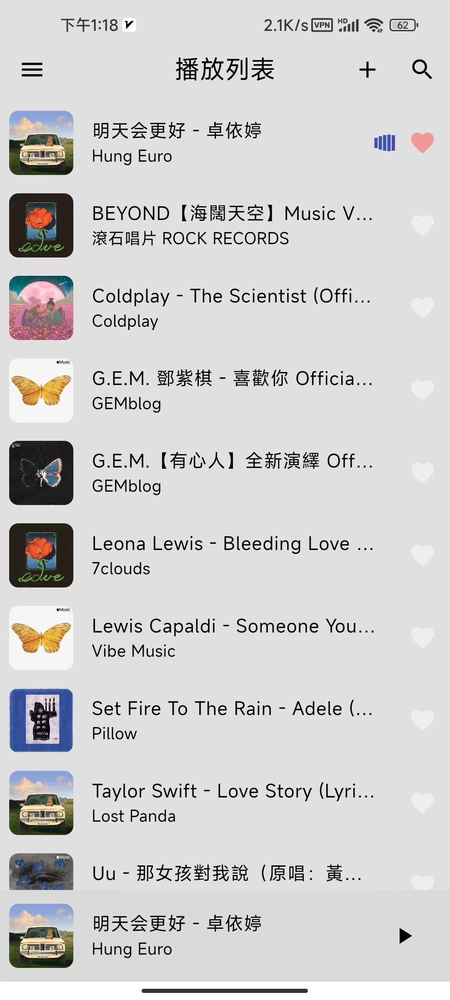
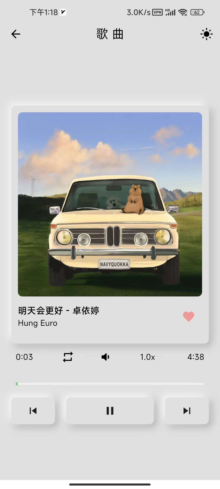
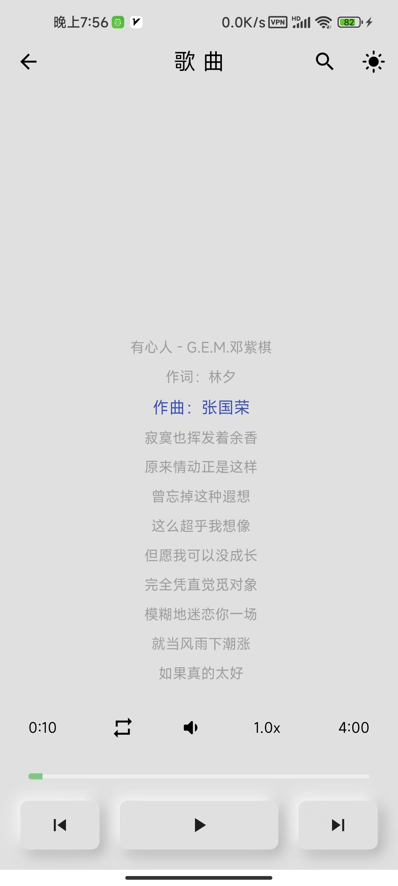
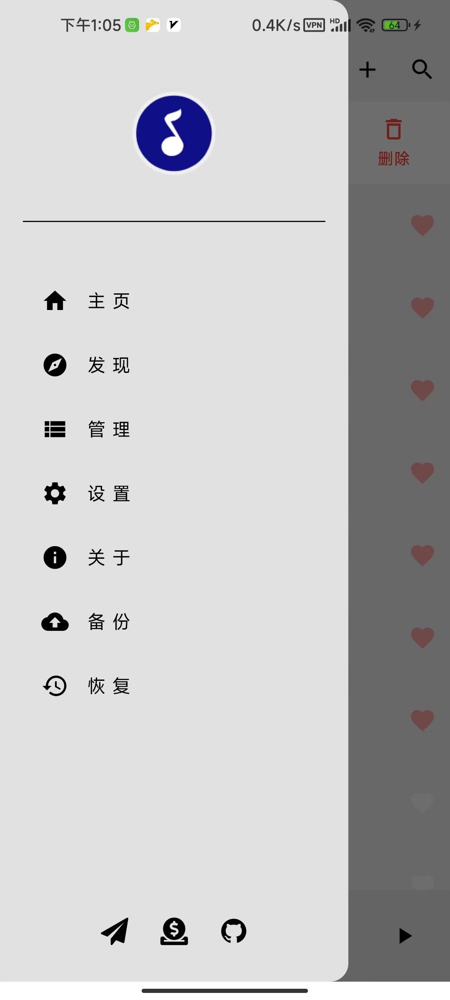
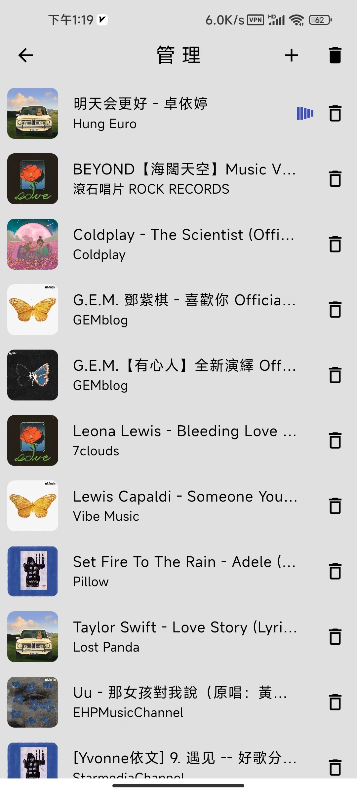
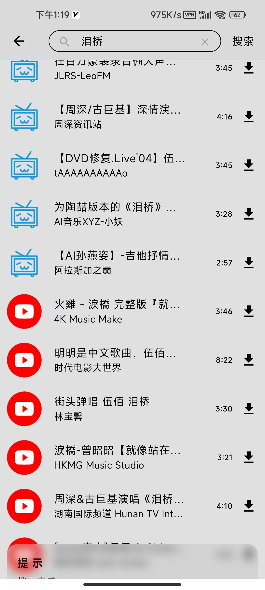
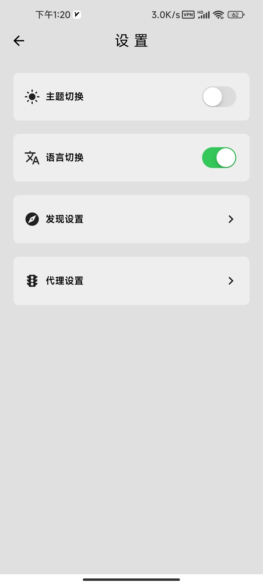
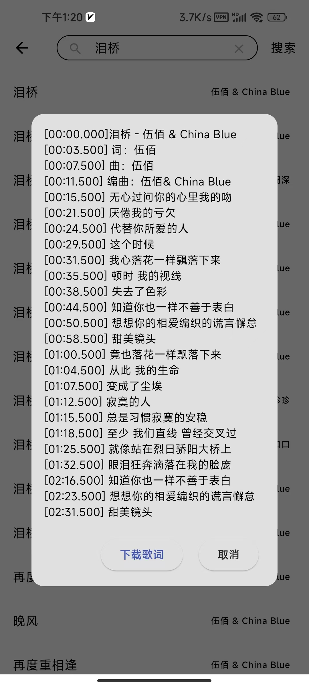
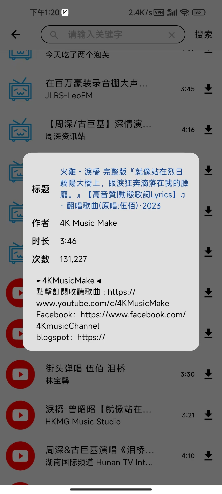
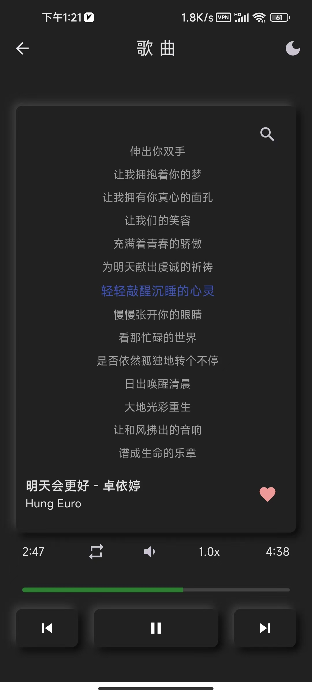

    
    
    
    
    
    
    
    
    
    

[中文文档](./README.zh-CN.md)
[Demo Video](https://www.bilibili.com/video/BV1rT421U76C/?vd_source=da23da82658adda9cbdfd045a9e6daf7#reply1704805075)

#### Introduction
It's a music player designed for Android platform. However, you can build it for Linux that is my development environment. If you want to build a Macos, ios or Windows version, you can try it without guarantee it will work. It's based on `Flutter` and `Rust`.

#### Features
- [x] play local music
- [x] manage music playlist
- [x] search and download youtube(video) and bilibili(audio) music
- [x] search, preview and download lyric
- [x] setting: light/dark theme, Chinese/English language, http/socks5 proxy for downloading music

#### How to build?
- Install `Rust` and `Cargo`
- Install `Flutter` and `FVM`(optional)
- Install Android `sdk`, `ndk`, `jdk`, and set environment variables
- Run `make` to build a release version android APK
- Run `make run` to run it on desktop platform
- Refer to [Makefile](./Makefile) for more information

#### Development Environment
- Linux: 6.7.2-arch1-2 #1 SMP PREEMPT_DYNAMIC Wed, 31 Jan 2024 09:22:15 +0000 x86_64 GNU/Linux
- Flutter version: 3.22.0
- Rust version: 1.77.1

#### Reference
- [Lab: Write your first Flutter app](https://docs.flutter.dev/get-started/codelab)
- [Cookbook: Useful Flutter samples](https://docs.flutter.dev/cookbook)
- [svg to png](https://cloudconvert.com/svg-to-png)
- [flutter_rust_bridge](https://github.com/fzyzcjy/flutter_rust_bridge)
- [freepik.com](https://www.freepik.com/)
- [flutter-action](https://github.com/marketplace/actions/flutter-action)
- [supported-formats](https://developer.android.com/media/platform/supported-formats)
- [music_api](https://github.com/yhsj0919/music_api)
